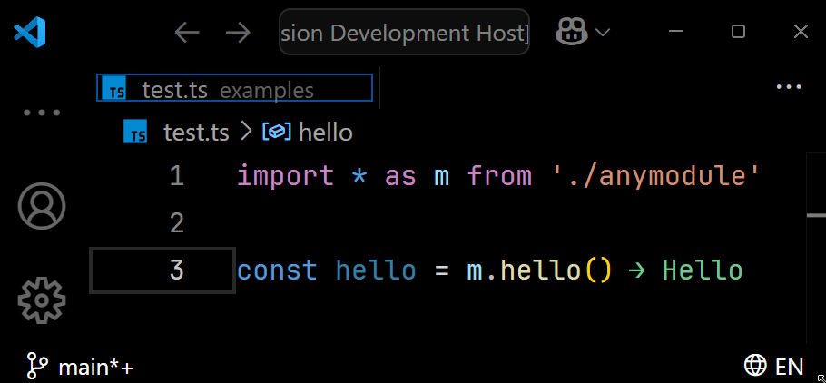
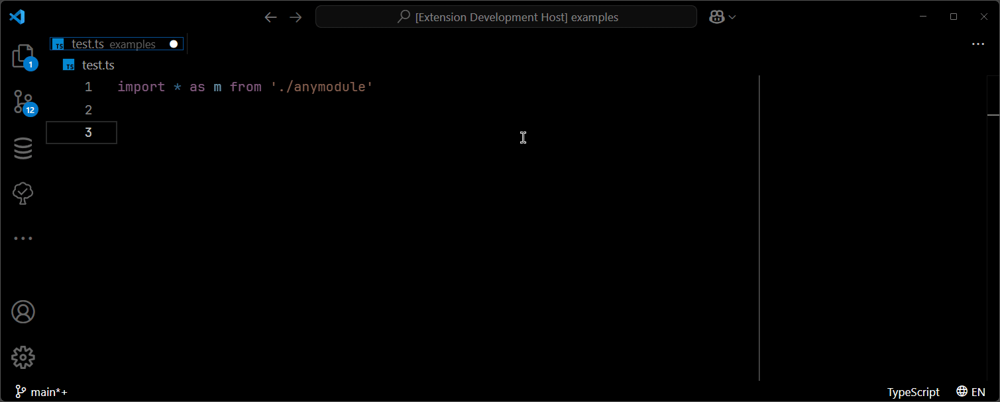
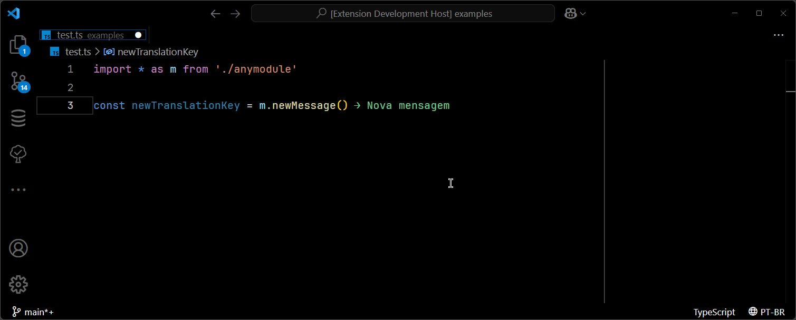

<p align="center">
  

  <p style="text-align:center;">Do easy i18n</p>

  <p style="text-align:center;">A command-line tool and vscode extension for easy internationalization (i18n) management in your projects. Seamlessly initialize, compile, and translate your application messages.</p>
</p>

## Table of Contents

- [Features](#features)
- [Installation](#installation)
  - [CLI](#cli)
  - [VSCode Extension](#vscode-extension)
- [Usage](#usage-cli)
- [Configuration](#configuration-cli)
- [License](#license)

## Features

### CLI

- 🚀 **Simple Setup**: Initialize a new i18n project with a single command
- 🔄 **Auto-compilation**: Watch for changes and recompile automatically
- 🌐 **AI Translation**: Automatically translate missing strings with DeepL integration
- 🧩 **TypeScript Support**: Built with and for TypeScript projects

### VSCode Extension

- 👁️ **Inline Visualization**: See translations directly in your code with inline decorations
- 🔍 **Quick Editing**: Edit or delete translations with a single click
- 🔄 **Extract Text**: Select text and extract it to a translation key
- 🌐 **AI Translation**: Automatically translate missing strings with DeepL integration
- 🌍 **Language Switching**: Easily switch between languages to view different translations
- 🚨 **Missing Translation Alerts**: Visual indicators for missing translations

## Installation

### CLI

```bash
# Install globally
npm install -g do-easy-i18n

# Or use with npx
npx do-easy-i18n <command>
```

### VSCode Extension

The VSCode extension is available in the [VSCode Marketplace](https://marketplace.visualstudio.com/items?itemName=do-easy.do-easy-i18n).

## Usage (CLI)

### Initialize a new project (CLI)

```bash
do-easy-i18n init
```

This creates:

- A `do-easy-i18n.json` configuration file
- A `messages` directory with an empty `en.json` file

### Compile messages (CLI)

```bash
# Basic compilation
do-easy-i18n compile

# With custom config and output paths
do-easy-i18n compile --config ./custom-config.json --output ./custom-output

# Watch mode for automatic recompilation
do-easy-i18n compile --watch
```

### Translate missing messages (CLI)

```bash
# Translate using default configuration
do-easy-i18n translate

# With custom config path
do-easy-i18n translate --config ./custom-config.json
```

### Configuration (CLI)

The configuration file (`do-easy-i18n.json`) has the following structure:

```json
{
  "languages": ["en", "fr", "es"],
  "defaultLanguage": "en",
  "deepL": {
    "host": "https://api-free.deepl.com",
    "apiKey": "your-deepl-api-key"
  }
}
```

| Property          | Description                                   |
| ----------------- | --------------------------------------------- |
| `languages`       | Array of language codes to support            |
| `defaultLanguage` | The source language for translations          |
| `deepL`           | DeepL configuration (optional)                |
| `deepL.host`      | DeepL API host (free or pro)                  |
| `deepL.apiKey`    | Your DeepL API key for automatic translations |

## Usage (VSCode Extension)

1. Open your project folder.

2. Ensure that you have a `do-easy-i18n.json` configuration file in your project.

3. Import a translation using the pattern `import * as`.

4. Use a translation and see the magic happen.


You can switch the decoration language in the status bar.



### Decoration colors

- Green color: Translation is present in all languages in the do-easy-i18n.json languages array.


- Yellow color: Translation is present in some languages in the do-easy-i18n.json languages array.


- Red color: Translation is missing in all languages in the do-easy-i18n.json languages array.


### Extension features

With the extension, you can:

- Add a translation key to the current file:



- Edit a translation key:


- Delete a translation key:



- Translate a missing translation key using DeepL:


- The extension will use the `defaultLanguage` to translate missing translations. If the default language has no source translation, the extension will fallback to the first language in the `languages` array.

## License

MIT
